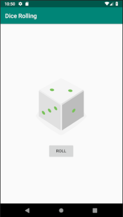

# Dice Rolling Android App
Simple app with two views: image of dice and button. After clicking the button, new random number is generated and corresponding dice image is presented. Part of the Udemy Kotlin Android Development course.
## Application screenshot
